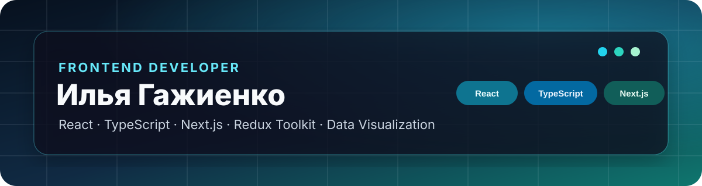

  

  <a href="https://rebrand.ly/richbanker-dev">Портфолио</a> ·
  <a href="https://www.olgagazhienko.ru">Production-проект</a> ·
  <a href="https://github.com/Richbanker?tab=repositories">Все репозитории</a>

  

## Обо мне

**Middle Frontend Developer** с опытом более 3 лет. Создаю интерфейсы и клиентские приложения на React и TypeScript: от административных панелей и аналитических дашбордов до SSR-приложений, Telegram Mini Apps и коммерческих сервисов с оплатой.

Работаю с новым кодом и развиваю legacy-проекты. Проектирую состояние приложения, интегрирую REST API, создаю таблицы и визуализации, настраиваю тестирование, CI/CD и production-развёртывание.

**Открыт к предложениям:** Middle / Middle+ Frontend Developer, удалённая или гибридная работа.

## Результаты

| Опыт | Влияние | Автоматизация | Портфолио |
|---|---:|---:|---:|
| 3+ года frontend-разработки | −30% времени на принятие решений | −25% трудозатрат на отчётность | 20+ публичных проектов |
| React, TypeScript, Redux | Административные панели и аналитика | Отчёты и интеграции с API | Учебные, командные и продуктовые проекты |

## Технологии

  
  
  
  
  
  
  
  
  
  

**Frontend:** React 17–19, TypeScript, JavaScript, Next.js App Router, Redux Toolkit, RTK Query, Zustand, React Router.

**UI и данные:** HTML, CSS, Sass, Tailwind CSS, Bootstrap, Recharts, Canvas API, Leaflet, адаптивная вёрстка.

**Инженерная практика:** REST API, SSR, WebSocket, Service Worker, Vitest, Jest, Testing Library, Playwright, Vite, Webpack, Git, Docker, CI/CD.

## Основные проекты

| Проект | Что реализовано | Стек |
|---|---|---|
| **[PDF Recipes Store](https://www.olgagazhienko.ru)** | Коммерческий магазин PDF-рецептов: каталог, YooKassa, webhook, email, защищённая выдача файлов, SEO и production-мониторинг | Next.js, TypeScript, Supabase, YooKassa, R2, Resend |
| **[Dino Game](https://github.com/Richbanker/dino-game)** | Командная Canvas-игра с SSR, авторизацией, форумом, лидербордом, offline-режимом и серверной частью. Роль: тимлид | React, TypeScript, Redux, Express, PostgreSQL, Docker |
| **[Stellar Burger](https://github.com/Richbanker/react-burger)** | Конструктор заказов, drag-and-drop, лента заказов, WebSocket, маршрутизация и тестирование пользовательских сценариев | React, TypeScript, Redux Toolkit, React DnD, Playwright |
| **[TypeScript Messenger](https://github.com/Richbanker/middle.messenger.praktikum.yandex)** | Мессенджер без фреймворка: собственная компонентная модель, EventBus, Router, HTTP и WebSocket | TypeScript, Vite, Handlebars, WebSocket |
| **[PROGIS Map](https://github.com/Richbanker/PROGIS-Map)** | Интерактивная карта с XYZ/WMS/WFS-слоями, GetFeatureInfo, GeoJSON и управлением порядком слоёв | React, TypeScript, Leaflet, Zustand, dnd-kit |
| **[DataGrid Designer](https://github.com/Richbanker/UI-BUILDER)** | Визуальный конструктор таблиц: колонки, фильтры, сортировка, агрегации и экспорт данных | React, TypeScript, JSON/CSV, CI |
| **[PulseBoard](https://github.com/Richbanker/pulseboard)** | Дашборд с потоком событий, графиками, состоянием подключения и адаптивным интерфейсом | React, TypeScript, Zustand, Recharts, WebSocket |
| **[MAX Chat](https://github.com/Richbanker/green-api-max-chat)** · **[Demo](https://richbanker.github.io/green-api-max-chat/)** | Адаптивный интерфейс личной переписки через GREEN-API MAX | React 19, TypeScript, Vite, REST API |

## Другие проекты

### Интерфейсы, дизайн-системы и визуализация

| Проект | Направление |
|---|---|
| [StyleLab](https://github.com/Richbanker/StyleLab) | Редактор дизайн-систем, интеграция с Figma API и Storybook |
| [Historical Dates](https://github.com/Richbanker/Historical-dates) | Интерактивный временной блок по техническому заданию |
| [Z-score Line Chart](https://github.com/Richbanker/zscore-linechart) | Визуализация статистических данных |
| [Map Assist](https://github.com/Richbanker/map-assist) | Работа с картами, местами, фильтрами и избранным |
| [Amino Aligner](https://github.com/Richbanker/Amino-Aligner) | Визуализация аминокислотных последовательностей |

### Приложения и продуктовые прототипы

| Проект | Направление |
|---|---|
| [Finance Mini App](https://github.com/Richbanker/Finance-Mini-App) | Учёт личных финансов и аналитика |
| [Good Deeds Calendar](https://github.com/Richbanker/good-deeds-calendar) | Telegram Mini App для календаря добрых дел |
| [DevGamify](https://github.com/Richbanker/DevGamify-) | Геймификация задач разработчика, XP, серии и достижения |
| [Bookshelf](https://github.com/Richbanker/Bookshelf) | Каталог книг с Google Books API и пользовательскими списками |
| [Game Inventory](https://github.com/Richbanker/game-inventory) | Управление игровым инвентарём и расчёт характеристик |
| [Auto Shop](https://github.com/Richbanker/autoshop) | Каталог автомобилей с сортировкой, пагинацией и URL-state |
| [Online Shop](https://github.com/Richbanker/online-shop) | Каталог, корзина, оформление и история заказов |

### Компоненты и управление состоянием

| Проект | Направление |
|---|---|
| [Parameter Editor](https://github.com/Richbanker/Parameter-Editor) | Drag-and-drop, история изменений, Zustand и валидация |
| [Param Editor](https://github.com/Richbanker/param-editor) | Типизированный React-компонент редактора параметров |
| [SPA Task Manager](https://github.com/Richbanker/SPA_TASK) | Управление задачами через Redux Toolkit |
| [Vue Todo](https://github.com/Richbanker/vue3-todo-vuex-ts) | Vue 3, TypeScript и Vuex |

## Что умею решать

- проектировать масштабируемые React-интерфейсы и состояние приложения;
- интегрировать REST API, WebSocket, платежи и внешние сервисы;
- создавать таблицы, фильтры, графики, карты и административные панели;
- переносить JavaScript-код на TypeScript и развивать legacy-проекты;
- настраивать SSR, Service Worker, CSP, тесты, Docker и CI/CD;
- вести командную разработку и отвечать за архитектурные решения.

## Сейчас в фокусе

- развитие production-магазина PDF-рецептов;
- завершение учебных проектов React Burger и TypeScript Messenger;
- развитие практики Next.js, SSR, тестирования и frontend-архитектуры;
- поиск позиции Middle / Middle+ Frontend Developer.

## English summary

Middle Frontend Developer with 3+ years of experience building React and TypeScript applications. Experienced in state management, REST integrations, data visualization, SSR, testing, CI/CD and maintaining legacy code. Open to remote and hybrid frontend opportunities.

## Контакты

- GitHub: [github.com/Richbanker](https://github.com/Richbanker)
- Production-проект: [olgagazhienko.ru](https://www.olgagazhienko.ru)
- Все репозитории: [github.com/Richbanker?tab=repositories](https://github.com/Richbanker?tab=repositories)

<!-- profile-maintenance: 2026-09-28 -->
